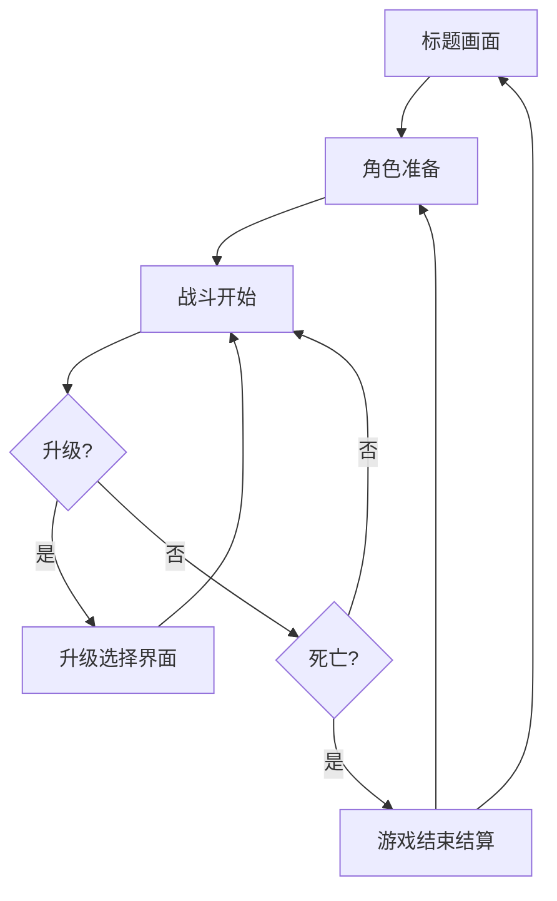

# 生存战线：孤胆佣兵 - 产品需求文档

## 1. 产品概述

一款网页版2D俯视角生存射击游戏，融合《吸血鬼幸存者》核心机制与现代写实军事风格。玩家扮演一名孤胆佣兵，在无尽的敌人浪潮中存活，通过击败敌人获取经验升级，解锁并强化多种现代武器与战术能力。

目标用户：喜爱Roguelike生存射击、追求爽快割草体验的玩家。单局时长10-20分钟，支持随时暂停与重新开始。

## 2. 核心特性

### 2.1 用户角色
| 角色 | 注册方式 | 核心权限 |
|------|----------|----------|
| 玩家 | 无需注册 | 直接游玩，本地存储最高分与解锁进度 |

### 2.2 功能模块
1. **标题画面**：游戏Logo、开始游戏、操作说明、设置选项
2. **角色准备画面**：武器预设选择、外观自定义
3. **游戏主画面**：核心战斗场景、HUD界面、暂停菜单
4. **升级选择画面**：三选一能力强化（每升一级触发）
5. **游戏结束画面**：本局统计、历史最高分、重新开始

### 2.3 页面详情
| 页面名称 | 模块名称 | 功能描述 |
|----------|----------|----------|
| 标题画面 | 主菜单 | 游戏标题动画背景、开始游戏按钮、设置面板、操作说明弹窗 |
| 角色准备 | 武器预设 | 选择开局携带的主武器（步枪/散弹枪/加特林/激光炮/手雷/浮游炮），影响初始build方向 |
| 游戏主画面 | 战斗场景 | 2D俯视角地图、玩家角色、敌人AI、子弹与特效、掉落物（经验、医疗包） |
| 游戏主画面 | HUD层 | 血条、经验条、等级、当前武器状态、波次倒计时、小地图 |
| 升级选择 | 能力卡片 | 三选一随机能力，含武器升级/角色属性/被动技能 |
| 游戏结束 | 结算面板 | 存活时间、击杀数、最高连杀、获得经验、解锁成就 |

## 3. 核心流程

玩家启动游戏后进入标题画面。点击"开始游戏"后进入角色准备画面，选择开局主武器后进入战斗。战斗中敌人从四面八方涌来，武器自动瞄准最近的敌人射击。击败敌人掉落经验球，拾取后积累经验值，满值后触发升级选择界面（游戏暂停，三选一能力）。随着时间推移，敌人波次强度递增，出现精英与Boss单位。玩家血量归零则游戏结束，进入结算画面。

## 4. 用户界面设计

### 4.1 设计风格
- **主色调**：深灰黑背景（#1a1a1f）+ 军绿色强调（#4a7c59）+ 危险橙（#e85913）
- **按钮样式**：扁平军事风格，直角边缘，悬停时微发光效果
- **字体**：标题使用粗体无衬线（Oswald），正文使用清晰易读的思源黑体/Noto Sans
- **布局风格**：全屏沉浸，HUD采用边缘悬浮布局不遮挡战斗区域
- **图标风格**：扁平化军事图标，带细微描边

### 4.2 页面设计概览
| 页面名称 | 模块名称 | UI元素 |
|----------|----------|--------|
| 标题画面 | 主视觉 | 动态战场背景（模糊处理的战斗场景循环播放）、中央Logo带微弱呼吸光效 |
| 标题画面 | 菜单按钮 | 垂直排列，军绿色边框，悬停时背景渐变为半透明军绿 |
| 角色准备 | 武器网格 | 6种武器卡片，选中时有橙色边框高亮，显示武器缩略图与简述 |
| 游戏主画面 | 战斗区域 | 2D俯视角，玩家居中，敌人从边缘生成，子弹轨迹与命中特效 |
| 游戏主画面 | HUD | 左上角血条（红）+护甲条（蓝）；顶部中央经验条（绿）；右上角波次/时间；左下角武器图标+弹药/冷却；右下角小地图 |
| 升级选择 | 能力卡片 | 三张卡片居中横排，黑色半透明背景遮罩，卡片带悬停放大效果，显示图标/名称/描述/稀有度边框色 |
| 游戏结束 | 结算面板 | 深色半透明面板居中，统计数字大字体显示，下方"再来一局"与"返回主菜单"按钮 |

### 4.3 响应式适配
- 桌面端优先（键盘WASD移动，鼠标瞄准/部分武器需手动点击射击）
- 支持全屏模式（F11或按钮切换）
- 移动端适配：虚拟摇杆控制移动，自动瞄准，UI按钮放大

### 4.4 2D场景指导
- **环境氛围**：废弃城市/军事基地，地面为混凝土/沥青纹理，散布废弃车辆与沙袋掩体
- **光照**：顶部全局光+武器开火时的动态点光源（枪口火焰照亮周围）
- **摄像机**：平滑跟随玩家，带轻微惯性延迟
- **特效重点**：枪口火焰、弹壳弹出、血液喷溅、爆炸火光、激光束、升级时的光环扩散
- **性能预算**：同屏敌人上限80个，粒子效果池化复用，确保60fps

## 5. 武器系统详细设计

| 武器 | 攻击方式 | 特点 |
|------|----------|------|
| 步枪 | 单发精准射击，中等射速 | 平衡型，穿透1个敌人 |
| 散弹枪 | 扇形散射5-8发弹丸 | 近距离高伤害，远距离衰减 |
| 加特林 | 极高射速，需预热 | 持续火力压制，移动速度降低 |
| 激光炮 | 蓄力后释放穿透激光束 | 穿透所有敌人，蓄力期间可瞄准 |
| 手雷 | 抛物线投掷，范围爆炸 | 自动投掷向密集敌群，有冷却 |
| 浮游炮 | 自动追踪无人机会自动攻击 | 持续存在，可同时拥有多个 |
