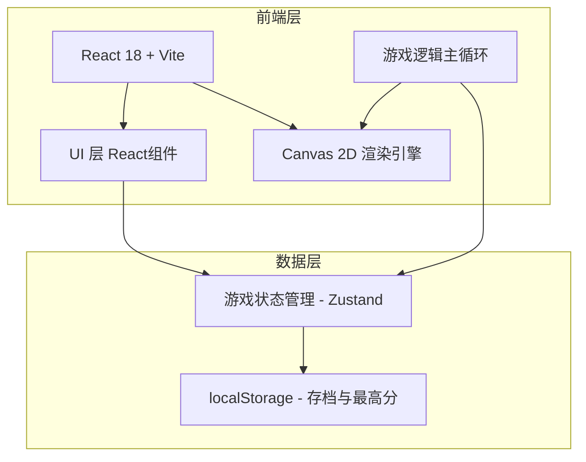

# 生存战线：孤胆佣兵 - 技术架构文档

## 1. 架构设计



## 2. 技术选型

- **前端框架**：React@18 + TypeScript（UI层与游戏状态管理）
- **构建工具**：Vite@5（快速开发与热更新）
- **游戏渲染**：HTML5 Canvas 2D API（通过React ref直接操作，性能最优）
- **状态管理**：Zustand（轻量级，适合游戏状态）
- **样式方案**：TailwindCSS（UI层样式）+ 内联样式（Canvas无关）
- **动画与特效**：Canvas原生绘制 + 粒子系统自研（无需额外库）
- **输入处理**：原生键盘/鼠标/触摸事件
- **音效**：Web Audio API（简单音效生成，无需外部资源）

## 3. 路由定义

| 路由 | 用途 |
|------|------|
| / | 标题画面（默认入口） |
| /prepare | 角色准备画面 |
| /game | 游戏主画面 |

注：实际使用Hash路由或条件渲染切换场景，非严格URL路由。

## 4. 核心模块架构

### 4.1 游戏引擎核心循环
```
GameLoop (requestAnimationFrame)
  ├── InputSystem (处理WASD/鼠标输入)
  ├── EntityManager (管理所有实体: 玩家、敌人、子弹、掉落物)
  ├── WeaponSystem (武器发射逻辑、冷却管理)
  ├── AISystem (敌人寻路与行为)
  ├── CollisionSystem (碰撞检测 - 空间哈希优化)
  ├── ParticleSystem (特效粒子管理)
  └── RenderSystem (Canvas绘制分层: 地面→实体→特效→UI)
```

### 4.2 实体组件系统（简化ECS）
- **Entity**: 唯一ID + 组件集合
- **PositionComponent**: x, y
- **VelocityComponent**: vx, vy
- **HealthComponent**: hp, maxHp
- **WeaponComponent**: weaponType, cooldown, damage
- **RenderComponent**: sprite/形状、颜色、大小
- **AIComponent**: 行为类型、目标、状态机

## 5. 数据模型

### 5.1 玩家存档
```typescript
interface PlayerSave {
  highScore: number;           // 最高存活时间(秒)
  totalKills: number;          // 累计击杀
  unlockedWeapons: string[];   // 已解锁武器
  bestRuns: RunRecord[];       // 最近10局记录
}

interface RunRecord {
  date: string;
  survivalTime: number;
  kills: number;
  maxCombo: number;
  levelReached: number;
}
```

### 5.2 武器配置
```typescript
interface WeaponConfig {
  id: string;
  name: string;
  type: 'rifle' | 'shotgun' | 'gatling' | 'laser' | 'grenade' | 'drone';
  damage: number;
  fireRate: number;      // 每秒射击次数
  range: number;
  piercing: number;      // 穿透数
  projectileCount: number; // 弹丸数(散弹用)
  cooldown: number;
  autoAim: boolean;
  projectileSpeed: number;
}
```

### 5.3 升级能力
```typescript
interface UpgradeOption {
  id: string;
  name: string;
  description: string;
  rarity: 'common' | 'rare' | 'epic' | 'legendary';
  type: 'weapon' | 'stat' | 'passive';
  effect: (player: PlayerState) => void;
}
```

## 6. 性能优化策略

1. **对象池**：子弹、敌人、粒子、经验球全部使用对象池，避免GC卡顿
2. **空间分割**：使用均匀网格（Spatial Grid）优化碰撞检测，O(n) → O(1)附近查询
3. **离屏渲染**：静态背景与地图元素预先绘制到离屏Canvas
4. **LOD简化**：远离摄像机的敌人减少特效与动画细节
5. **帧率独立**：所有移动与计时使用deltaTime，确保不同帧率下一致的游戏速度
6. **渲染分层**：地面层（不每帧重绘）→ 实体层 → 特效层 → UI层
